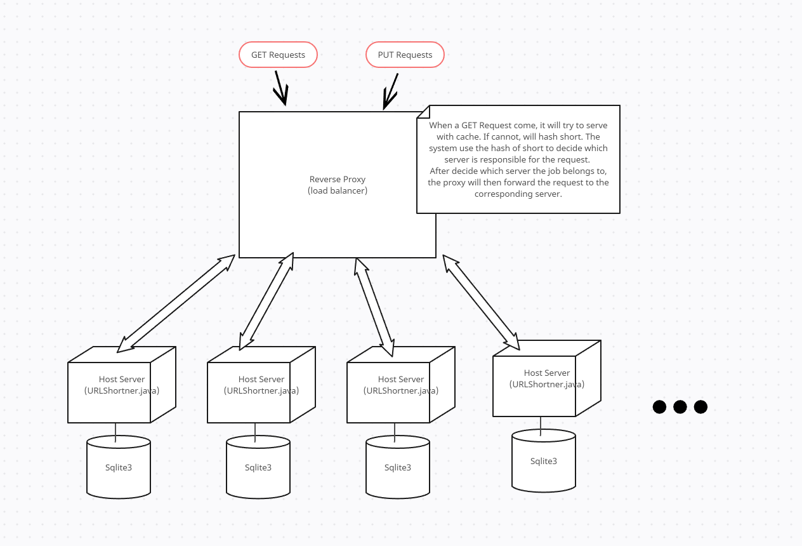
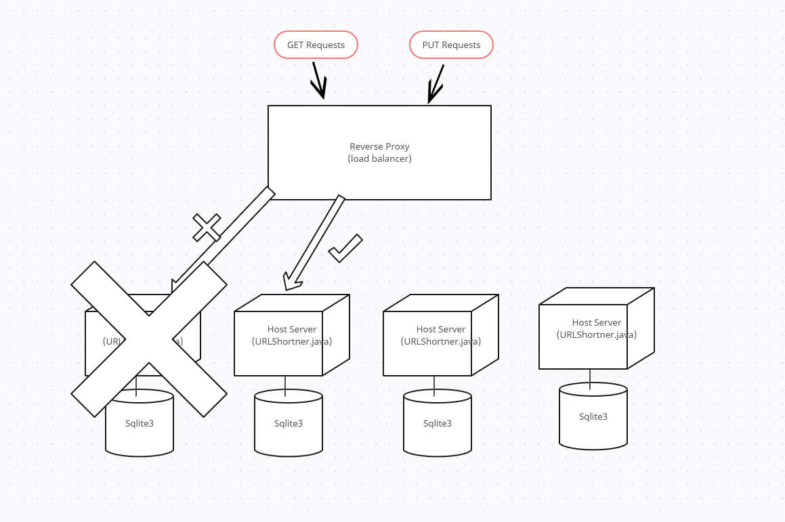
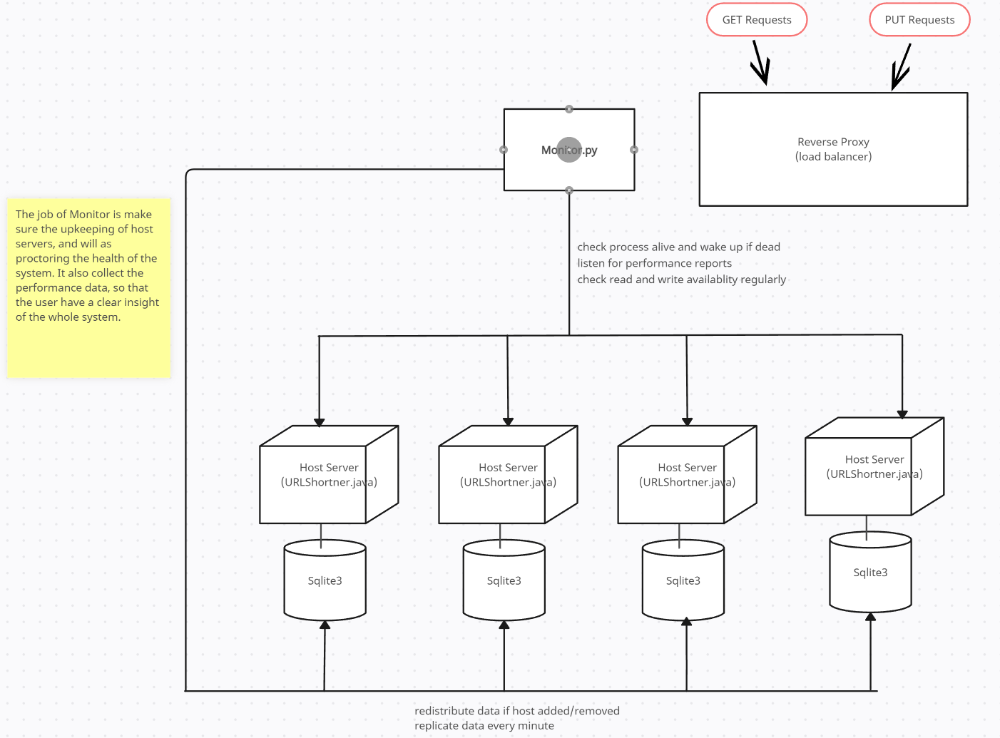
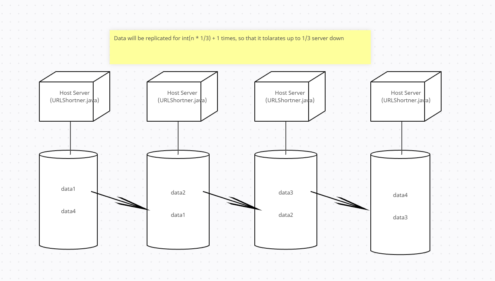

# CSC409 A1 Report

The project is consist of 3 main parts

- URLShortner.java (will refer as host server below)
- ProxyServer.java
- Monitor.py


### Usage:

0. ```make```

1. put target host servers IP and port to ```hosts``` file, e.g:

   ```
   dh2026pc20:12345
   dh2026pc21:12345
   dh2026pc22:12345
   dh2026pc23:12345
   ```

2. ```MonitorInfo``` file should contain

   ```
   dh2026pc16  <- Where monitor is running on 
   54555       <- port
   ```

3. start the monitor, which will also start the hosts up ```python3 Monitor.py```
4. start proxy server ```make proxy > output 2>&1 &```

5. After proxy server is started, it will prompt which port it is listening on. It can now be reached and start serving.


### Performance Test

under ```performanceTesting/``` , ```parallelGetAll.java``` is used for benchmarking GET request and ```parallelPutAll.java``` is for benchmarking PUT request.

##### Usage:

```bash
javac parallelGetAll.java
javac parallelPutAll.java

java parallelGetAll {hostname} {PORT} {numRequest}
```

##### Mechanism

For testing purposes, we used Java built-in HttpClient class which is asynchronous in nature. It is internally using a pool of threads to handle connections and responses. We also employed CompletableFuture, and it represents a future result for async computation. We then use get() to wait for all threads to finish so that it could finish and be timed to get the total server processing time.


### Performance 

4000 PUT requests in 12.89s

4000 GET request in 1.7s

#### Performance under load1: 1 sender and 4 hosts


#### Performance under load1: 2 sender and 4 hosts


## Design Details




#### Server Disaster

If the primary host server is not reachable, the proxy will then try its backups and forward the requests to it's backups. The backups are design to be able to cover the work for the offline host (as they have the data as well).




### Monitor System

The monitor system listens for performance report from each host. It also checks if read and write is available on each host and tries to wake up if any is not available. It also handles the data replication and redistribute when hosts added/removed.




### About the architecture

**Consistency**:

- The data is always correct
- After adding a new host, the data will be redistributed
- The request will be handled correctly, regardless if the primary host is down. The request will then be forwarded to backup hosts.

**Availability**:

- When a host is down, there will be backup server to cover it's job.
- When a host is unreachable, the monitor soon knows, and will try to bring up the server, if possible.
- When adding a new host, the system will be down for a short period to redistribute data.

**Partition tolerance**:

- If a host is unavailable (process disaster or machine disaster), the corresponding request will still be served, thanks to the backup server mechanism.

**Data partitioning**:

- For each incoming requests, the job will be distributed by hashing short. Only selected host will be responsible for the job, and thus its database will only consist of its own data.

**Data replication**:

- Data will be replicated for $ \lfloor{\frac{n}{3}}\rfloor + 1$ times, so that it tolerates up to 1/3 server down

  

- data replication is handled by Monitor, which will replicate the databases of each server every 15 seconds (configurable)

**Load balancing**:

- Like mentioned above, each incoming requested have a dedicate host to handle, which is decided by hashing short.
- hashing function is Java build-in ```String.hashCode()```. 
- Tested, ```String.hashCode()``` function is quite fair.

**Caching**:

- Proxy has caching technic. Cache is a LRU Cache (least recent use) of configurable size with default value 5000 entries. 
- When a GET request come, firstly it will try to look in cache. If found, it will response to user, without troubling host server.

**Process disaster recovery**:

- If URLShortner process is killed, it can be bring up without hustle with data/state of work.
- Monitor keep monitoring all hosts. If a host disappear, it will try to bring it back up.

**Data disaster recovery**:

- If a host machine die, after it is recovered, the process will be bring up, and will serve as usual.
- The host server will seek for lost data in its backup databases. 
- At worst, only the data written in past 15 seconds will be lost.

**Orchestration**:

- When we start Monitor, all host server will be brought up by Monitor.
- When Monitor is terminated, all hosts will be shutdown gracefully.
- All processes are monitored, and will be brought up shortly after a disaster happens.

**Health-check**:

- Monitor will check health of processes every 15s (configurable)

**Horizontal scalability**:

- More host servers, less job for each host, and their databases. The whole system will then be more robust.

**Vertical scalability**:

- Jobs are handled in multi-threaded fashion, thus the software will utilize as much computing and storage resources as possible.

**Well formatted document**:

- TL;DR. Straight 110% XD